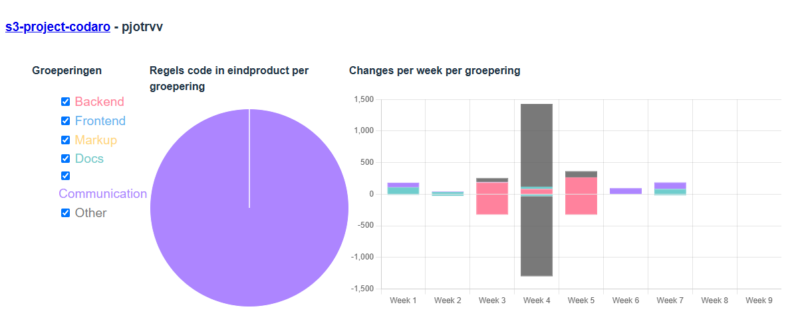

#  Sprint A Backend

## Impressie

<!-- vertel heel kort hoe het product er voor staat, en wat jouw aandeel er in was deze sprint. Voeg een paar screenshots toe hoe het product er nu uit ziet, met een nadruk op je eigen werk, maar een algemene indruk van het geheel is ook waardevol voor het portfolio. Het idee is dat we dit per sprint doen, dus aan het eind een 
mooi plaatje van de groei overhouden -->

## Stats

<!-- Deze statistieken zullen met een PR aangeleverd worden -->

<!-- 
Als hier geen gekkigheid staat, dan hoef je dit niet toe te lichten. Maar als hier vreemde zaken staan (zoals heeeel veel frontend-code in een backend-sprint, of een week nagenoeg afwezig) dan is dit het moment dat toe te lichten. -->

## Zelfbeoordeling

* Analist Kwantiteit - [Boven/Op/Onder] Niveau: 

<!-- Wat heb je zoal gedaan deze sprint? Link de grotere user-stories waar je aan hebt gewerkt -->

* Analist - Kwaliteit - [Boven/Op/Onder] Niveau
    <!-- Link per onderdeel een voorbeeldig stuk code of screenshot en vertel in een paar zinnen waarom dit zo'n goed voorbeeld is -->
    * [User Stories]
        * https://github.com/HU-SD-S3-Studenten-S2526/s3-project-codaro/issues/69
        * https://github.com/HU-SD-S3-Studenten-S2526/s3-project-codaro/issues/63
        * https://github.com/HU-SD-S3-Studenten-S2526/s3-project-codaro/issues/62
        * https://github.com/HU-SD-S3-Studenten-S2526/s3-project-codaro/issues/60
        * https://github.com/HU-SD-S3-Studenten-S2526/s3-project-codaro/issues/59
    * Diagrammen:
     
     
     
     

     

     

    ...
    * [Opdrachtgever-communicatie]():
    * 

    ...
    * [Relatie tot code]():
    - https://github.com/HU-SD-S3-Studenten-S2526/s3-project-codaro/pull/100
    - https://github.com/HU-SD-S3-Studenten-S2526/s3-project-codaro/pull/105

* Scrum Master - [Boven/Op/Onder] Niveau:

Ik heb o.a communicatie met p.o gedaan, presentatie gemaakt en gegeven tijdens de sprint review, heb ik een knelpunt analyse gemaakt en heb ik ook nog github issues aangemaakt voor de volgende sprint.

* Professionele Houding - [Boven/Op/Onder] Niveau
    * tov. Team: Het team was tevreden <!-- Is het gelukt om je beloofde werk binnen een redelijke tijd op te leveren? Heb je werk van anderen kunnen reviewen? -->
    * tov. Opdrachtgever: Iets professionelere demo en meer test data en accounts klaar zetten. <!-- Hoe reageerde de opdrachtgever op jouw werk deze sprint? Is het mooi afgekomen? Of heb je duidelijk van tevoren aangegeven wat wel/niet zou gaan werken? -->
    * tov. Eigen ontwikkeling: Volgende keer wil ik meer bezig zijn met een sprint doel en het grotere plaatje alvast beter in beeld krijgen. <!-- Is het gelukt om serieus je rol aan te pakken? Wat zou je graag anders hebben gedaan en/of een volgende keer anders doen?-->
