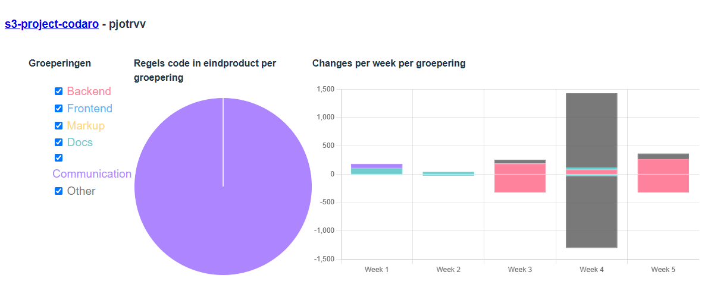
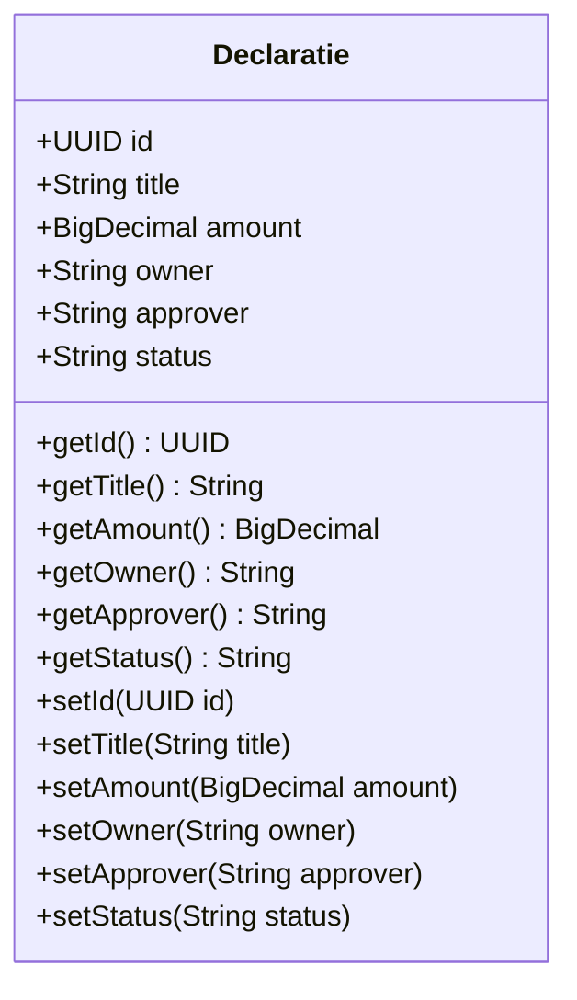

#  Sprint A Backend

## Impressie

<!-- vertel heel kort hoe het product er voor staat, en wat jouw aandeel er in was deze sprint. Voeg een paar screenshots toe hoe het product er nu uit ziet, met een nadruk op je eigen werk, maar een algemene indruk van het geheel is ook waardevol voor het portfolio. Het idee is dat we dit per sprint doen, dus aan het eind een 
mooi plaatje van de groei overhouden -->

## Stats

<!-- Deze statistieken zullen met een PR aangeleverd worden -->

<!-- 
Als hier geen gekkigheid staat, dan hoef je dit niet toe te lichten. Maar als hier vreemde zaken staan (zoals heeeel veel frontend-code in een backend-sprint, of een week nagenoeg afwezig) dan is dit het moment dat toe te lichten. -->

## Zelfbeoordeling

* Backend Code Kwantiteit - [Op] Niveau: Ik heb een declaratie controller gemaakt met CRUD functionalitein en een DeclaratieService die nieuwe declaratie aanmaakt en opslaat in de database. Daarnaast heb ik ook nog DTO's gemaakt voor elke inkomende request en uitgaande responses.

<!-- Wat heb je zoal gedaan deze sprint? Link de grotere user-stories waar je aan hebt gewerkt -->

* Backend Code - Kwaliteit - [Op] Niveau Ik heb voor het Declaratie model data validatie toegepast op basis van o.a de business rules die geanalyseerd zijn.
    <!-- Link per onderdeel een voorbeeldig stuk code of screenshot en vertel in een paar zinnen waarom dit zo'n goed voorbeeld is -->
    * Domeinmodel:

* Architectural Compliance: https://github.com/HU-SD-S3-Studenten-S2526/s3-project-codaro/blob/ff6e2cc74e54acc7145fde66c05e27feeb3ae769/backend/src/main/java/nl/hu/s3/project/declaratie/application/DeclaratieService.java
  
* Datamodel:

* Restful Endpoints: https://github.com/HU-SD-S3-Studenten-S2526/s3-project-codaro/blob/ff6e2cc74e54acc7145fde66c05e27feeb3ae769/backend/src/main/java/nl/hu/s3/project/declaratie/presentation/DeclaratieController.java
Dit is de controller van de declaraties. Hierin staan alle endpoints.

| Endpoint          	| Method 	|
|-------------------	|--------	|
| /declaraties      	| GET    	|
| /declaraties      	| POST   	|
| /declaraties/<id> 	| GET    	|

Dit is volgens rest omdat de declaraties in meervoud gespeld zijn en er een get id endpoint is

* Framework-gebruik: https://github.com/HU-SD-S3-Studenten-S2526/s3-project-codaro/blob/ff6e2cc74e54acc7145fde66c05e27feeb3ae769/backend/src/main/java/nl/hu/s3/project/declaratie/dto/DeclaratieRequestDTO.java
Validation toegevoegd aan de request dto voor declaraties

* Productie Deployment - [Op] Niveau: Ik heb een VM aangemaakt in Azure hierop Node en de JDK geinstaleerd daarna heb ik doormiddel van Secure Copy Protocol met een SSH key de repository naar de VM gestuurd en daarna deze gestart. 

<!-- Vertel kort hoe je de deployment naar productie hebt aangepakt.
     Het kan zijn dat je er deze sprint niet zo aan toe bent gekomen, omdat er 2 backend-studenten in je team zaten. Dan komt dit wel in een latere sprint.
 -->

* Professionele Houding - [Op] Niveau
    * tov. Team: Ik heb alle user stories die ik geassigned kreeg goed afgemaakt. <!-- Is het gelukt om je beloofde werk binnen een redelijke tijd op te leveren? Heb je werk van anderen kunnen reviewen? -->
    * tov. Opdrachtgever: De opdracht gever reageerde goed, hij vond het erg goed dat we al een dashboard hadden voor declaraties. <!-- Hoe reageerde de opdrachtgever op jouw werk deze sprint? Is het mooi afgekomen? Of heb je duidelijk van tevoren aangegeven wat wel/niet zou gaan werken? -->
    * tov. Eigen ontwikkeling: Ja, ik zou alleen meer willen leren over Docker en hoe logica in de Domein te verwerken. <!-- Is het gelukt om serieus je rol aan te pakken? Wat zou je graag anders hebben gedaan en/of een volgende keer anders doen?-->
