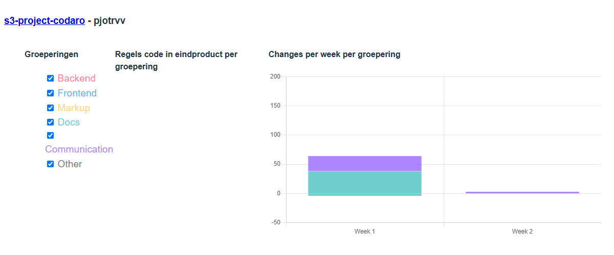

# Sprint 0

## Impressie

<!-- 
Vertel heel kort hoe het product er voor staat, en wat jouw aandeel er in was deze sprint. Link een paar schetsen wat je graag zou bouwen, en/of post de sprint-0
hello-world screenshots. Waarschijnlijk is het nog niet veel, maar nu een mooi 'Before' beeld maakt de volgende sprints leuker om te zien -->

## Stats

<!-- Deze statistieken zullen met een PR aangeleverd worden -->

<!-- 
Hier is als het goed is nog niet zoveel te zien. Meer een test voor ons docenten of we dit logistiek werkend gaan krijgen! -->

- [Requirement analyse sprint 0](../../../requirements.md)
- [Visie Scope](./VisieScope.md)

## Zelfbeoordeling

* Kwantiteit - [Op] Niveau: Op <!-- Streep weg wat niet van toepassing is -->

<!-- Wat is jouw aandeel geweest in het ontwikkelen van de team-visie wat er gebouwd moet gaan worden? 
     Als je dit makkelijk kan aangeven met een linkje, graag. Maar je hoeft echt niet per regel te gaan citeren. -->

* Kwaliteit - [Op] Niveau <!-- Streep weg wat niet van toepassing is -->

<!-- Vind je zelf dat je het helder/duidelijk/netjes gecommuniceerd of gemaakt hebt? Wellicht ben je zelf
     verrast hoe goed het ging, of had je het veel beter kunnen doen als je maar meer tijd had gehad. -->

* Portfolio - [Onder] Niveau <!-- Streep weg wat niet van toepassing is -->
  
<!-- Is het gelukt om je portfolio als statische Github site online te zetten? Heb je daar nog evt. extras aan toegevoegd? Er is best veel mogelijk met Github pages, en eerlijk gezegd beoordelen we totaal niet op hoe het eruit ziet (mits het functioneel is!). Maar het is natuurlijk wel leuk en motiverend hier iets moois van te maken -->

* Professionele Houding - [Op] Niveau <!-- Streep weg wat niet van toepassing is -->
  * tov. Team: Boven <!-- Is het gelukt om goed kennis te maken, afspraken te maken, teamcontract op te stellen, etc. Of lag je er een beetje buiten? -->
  * tov. Opdrachtgever: Op <!-- Is het gelukt om zelf een helder beeld van de opdracht te krijgen? Heb je inspiratie hoe/wie/wat/waar te beginnnen? -->
  * tov. Eigen ontwikkeling: Op <!-- Is het gelukt om goed te starten? Vroeg opstaan na de zomervakantie? Alle tooltjes installeren? Wat zou je graag anders hebben gedaan en/of een volgende keer anders doen? Zijn er nog open vragen die je beantwoord moet hebben om goed te kunnen starten? -->
