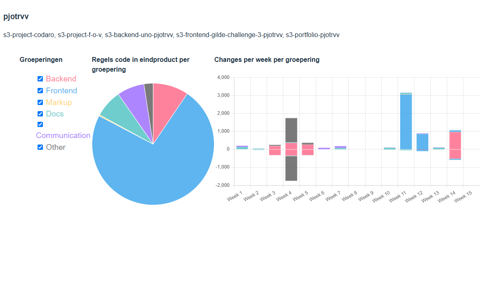

#  Sprint B-1

## Impressie

<!-- vertel heel kort hoe het product er voor staat, en wat jouw aandeel er in was deze sprint. Voeg een paar screenshots toe hoe het product er nu uit ziet, met een nadruk op je eigen werk, maar een algemene indruk van het geheel is ook waardevol voor het portfolio. Het idee is dat we dit per sprint doen, dus aan het eind een 
mooi plaatje van de groei overhouden -->
Het project loopt een klein beetje achter, op dit moment op front-end. We zijn van plan componenten reusable te maken om de front-end makkelijker te ontwikkelen.

## Stats

<!-- Deze statistieken zullen met een PR aangeleverd worden -->

<!-- 
Als hier geen gekkigheid staat, dan hoef je dit niet toe te lichten. Maar als hier vreemde zaken staan (zoals heeeel veel frontend-code in een backend-sprint, of een week nagenoeg afwezig) dan is dit het moment dat toe te lichten. -->

## Zelfbeoordeling

* Kwantiteit - [Boven] Niveau: Ik heb redelijk veel code geschreven, dus ik hoop dat dat het genoeg aangeeft.
  - https://github.com/HU-SD-S3-Studenten-S2526/s3-project-codaro/pull/104
  - https://github.com/HU-SD-S3-Studenten-S2526/s3-project-codaro/pull/96
  - https://github.com/HU-SD-S3-Studenten-S2526/s3-project-codaro/pull/106
  - https://github.com/HU-SD-S3-Studenten-S2526/s3-project-codaro/pull/108
  - https://github.com/HU-SD-S3-Studenten-S2526/s3-project-codaro/pull/110

<!-- Wat heb je zoal gedaan deze sprint? Link de grotere user-stories waar je aan hebt gewerkt. -->

* Kwaliteit - [Op] Niveau: Ik heb een account creation page aangemaakt voor managers om accounts aan te maken.
  - https://github.com/HU-SD-S3-Studenten-S2526/s3-project-codaro/pull/104
  - https://github.com/HU-SD-S3-Studenten-S2526/s3-project-codaro/pull/96
  - https://github.com/HU-SD-S3-Studenten-S2526/s3-project-codaro/pull/106
  - https://github.com/HU-SD-S3-Studenten-S2526/s3-project-codaro/pull/108
  - https://github.com/HU-SD-S3-Studenten-S2526/s3-project-codaro/pull/110
  
  

<!-- Waarom is het goed wat je gemaakt hebt? Hanteer bijvoorbeeld de criteria uit blok A, of stel zelf (in overleg met je docenten) criteria op die je probeert na te streven. -->    

* Oplevering - [Boven/Op/Onder] Niveau: Op
  ...

<!-- Is het gelukt om jouw werk netjes op te leveren zodat het echt gebruikt kan worden. Is het netjes getest voordat het gedemo'd wordt. Was er bestaande data die gemigreerd moest worden?

 -->

* Professionele Houding - [Boven/Op/Onder] Niveau
    * tov. Team: Ja, en ja <!-- Is het gelukt om je beloofde werk binnen een redelijke tijd op te leveren? Heb je werk van anderen kunnen reviewen? -->
    * tov. Opdrachtgever: Goed, alles is afgekomen, en alles werkte. Daarnaast was ook alles gedeployed. <!-- Hoe reageerde de opdrachtgever op jouw werk deze sprint? Is het mooi afgekomen? Of heb je duidelijk van tevoren aangegeven wat wel/niet zou gaan werken? -->
    * tov. Eigen ontwikkeling: Ja, volgende keer zou ik liever ui libraries gebruiken. <!-- Is het gelukt om serieus je rol aan te pakken? Wat zou je graag anders hebben gedaan en/of een volgende keer anders doen?-->
